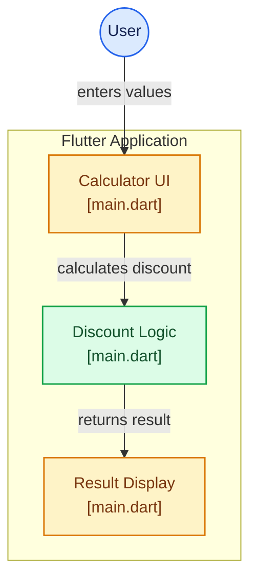

# 💸 Discount Calculator

A simple **Discount Calculator** built with **Flutter**. The application allows users to enter an original price and discount percentage and calculate the discount amount and final price.

🔗 **GitHub Repository:**
https://github.com/shaikyasirahmed07/discount-calculator

---

## 📌 Overview

The **Discount Calculator** provides a simple interface for calculating:

* **Discount Amount**
* **Final Price After Discount**

The calculation logic and user interface are implemented in `lib/main.dart`.

---

## 🏗️ Application Architecture



---

## ✨ Features

* 🧮 Calculate discount amount
* 💰 Calculate final price
* ⚡ Instant calculation
* 🎨 Simple user interface
* 🔢 Numeric input handling
* 📱 Flutter-based application

---

## 🛠️ Tech Stack

| Technology       | Purpose               |
| ---------------- | --------------------- |
| **Flutter**      | Application framework |
| **Dart**         | Programming language  |
| **Material UI**  | User interface        |
| **Git & GitHub** | Version control       |

---

## 🖥️ Supported Platforms

The repository includes Flutter configuration directories for Android, iOS, Web, Windows, macOS, and Linux.

**Currently documented as supported:** Android.

| Platform    | Status                                  | Output      |
| ----------- | --------------------------------------- | ----------- |
| **Android** | ✅ Supported                             | Android APK |
| **iOS**     | ⚪ Not currently documented as supported | —           |
| **Web**     | ⚪ Not currently documented as supported | —           |
| **Windows** | ⚪ Not currently documented as supported | —           |
| **macOS**   | ⚪ Not currently documented as supported | —           |
| **Linux**   | ⚪ Not currently documented as supported | —           |

> The presence of a platform directory in a Flutter repository does not by itself confirm that the application has been tested, built, or released for that platform.

### Android Build

Generate the Android release APK with:

```bash
flutter build apk --release
```

The APK is generated under:

```text
build/app/outputs/flutter-apk/
```

---

## 📂 Project Structure

```text
discount-calculator/
│
├── android/
├── ios/
├── lib/
│   └── main.dart
├── macos/
├── test/
├── web/
├── windows/
├── linux/
├── pubspec.yaml
├── pubspec.lock
└── README.md
```

---

## 🧩 Main Component

### `lib/main.dart`

The main application file contains the calculator interface, calculation logic, and result display.

```text
lib/main.dart
```

---

## 🧮 Calculation Logic

### Discount Amount

```text
Discount Amount = Original Price × Discount Percentage / 100
```

### Final Price

```text
Final Price = Original Price - Discount Amount
```

### Example

For an original price of **₹1,000** with a **20% discount**:

```text
Discount Amount = 1000 × 20 / 100
                = ₹200

Final Price = 1000 - 200
            = ₹800
```

---

## 🔄 Application Workflow


---

## 📊 Example Calculations

| Original Price | Discount | Discount Amount | Final Price |
| -------------: | -------: | --------------: | ----------: |
|           ₹500 |      10% |             ₹50 |        ₹450 |
|         ₹1,000 |      20% |            ₹200 |        ₹800 |
|         ₹2,500 |      15% |            ₹375 |      ₹2,125 |
|         ₹5,000 |      25% |          ₹1,250 |      ₹3,750 |

---

## 🚀 Getting Started

### Prerequisites

Install:

* Flutter SDK
* Dart SDK
* Git
* Android Studio or VS Code
* Android emulator or physical Android device

Verify Flutter:

```bash
flutter doctor
```

### Clone the Repository

```bash
git clone https://github.com/shaikyasirahmed07/discount-calculator.git
cd discount-calculator
```

### Install Dependencies

```bash
flutter pub get
```

### Run the Application

```bash
flutter run
```

To view available Flutter targets:

```bash
flutter devices
```

---

## 🧪 Testing & Code Quality

Run the test suite:

```bash
flutter test
```

Analyze the project:

```bash
flutter analyze
```

Format the Dart code:

```bash
dart format .
```

---

## 🔐 Input Validation

The calculator should handle:

* Valid numeric prices
* Valid discount percentages
* Empty input fields
* Invalid numeric input
* Negative values
* Discount percentages outside the expected range

---

## 🚀 Future Improvements

* [ ] Add GST/tax calculation
* [ ] Add currency selection
* [ ] Add calculation history
* [ ] Add dark mode
* [ ] Add percentage presets
* [ ] Add copy/share result functionality
* [ ] Add localization
* [ ] Add additional unit and widget tests
* [ ] Verify support for additional platforms

---

## 🤝 Contributing

Contributions are welcome.

```bash
git checkout -b feature/new-feature
git add .
git commit -m "Add new feature"
git push origin feature/new-feature
```

Then open a Pull Request on GitHub.

---

## 📄 License

This project is available for educational and development purposes.

---

## 👨‍💻 Author

**Shaik Yasir Ahmed**

GitHub:
https://github.com/shaikyasirahmed07

Repository:
https://github.com/shaikyasirahmed07/discount-calculator

---

## ⭐ Support

If you find this project useful, consider giving the repository a ⭐ on GitHub.
